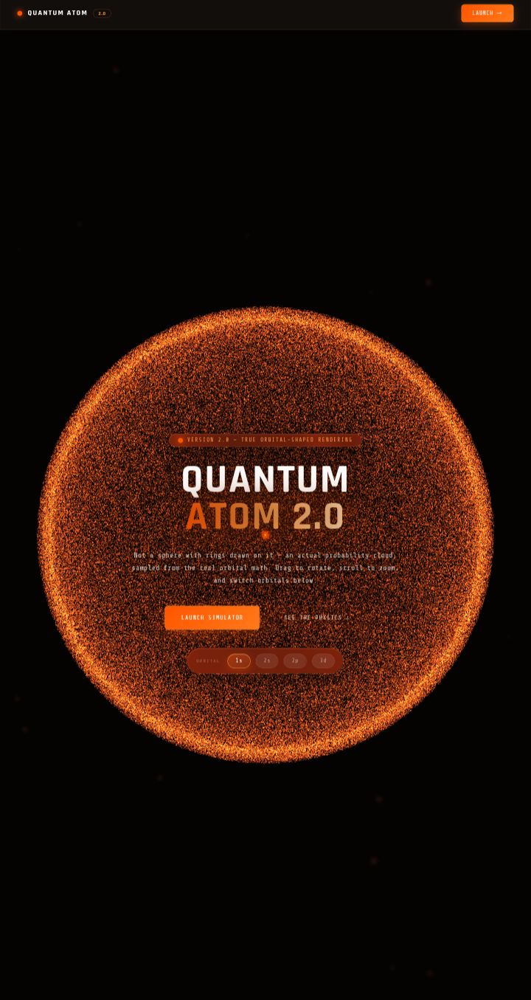

# Quantum Atom 2.0

**Quantum Atom 2.0 is the world’s first full 118-element 3D atom simulator, bringing all 118 chemical elements into one free, interactive platform.** Designed to run directly in a web browser across mobile devices and computers, it allows users to explore atomic structures, electron configurations, and quantum orbitals in an interactive 3D environment. From Hydrogen to Oganesson, the entire periodic table becomes explorable in a single simulator. ⚛️🌌

**A real-time, browser-based 3D atom simulator and nucleus explorer.**
Every element, drawn as a true orbital-shaped probability cloud, and a second tool that takes you inside the nucleus, down through protons and neutrons to quarks, and on to the Planck length.

No install. No build step. No accounts. Open a page and rotate an atom.

[](https://nazat02.github.io/Quantum-Atom-2.0/)

- **Live site:** <https://nazat02.github.io/Quantum-Atom-2.0/>
- **Repository:** <https://github.com/nazat02/Quantum-Atom-2.0>
- **Author:** Md. Shaikhul Hadis Nazat
- **Launch date:** 30 September 2026

---

## Table of contents

1. [What is Quantum Atom?](#1-what-is-quantum-atom)
2. [Highlights](#2-highlights)
3. [The three pages](#3-the-three-pages)
4. [Quick start](#4-quick-start)
5. [Using the Atom Simulator](#5-using-the-atom-simulator)
6. [Using the Nucleus Explorer](#6-using-the-nucleus-explorer)
7. [Keyboard shortcuts](#7-keyboard-shortcuts)
8. [Shareable links and deep links](#8-shareable-links-and-deep-links)
9. [Moving between the two tools](#9-moving-between-the-two-tools)
10. [The science behind it](#10-the-science-behind-it)
11. [Performance and mobile behaviour](#11-performance-and-mobile-behaviour)
12. [Saved settings (localStorage)](#12-saved-settings-localstorage)
13. [Project structure](#13-project-structure)
14. [Architecture notes](#14-architecture-notes)
15. [Running locally and deploying](#15-running-locally-and-deploying)
16. [Browser support and requirements](#16-browser-support-and-requirements)
17. [Known limitations](#17-known-limitations)
18. [Troubleshooting](#18-troubleshooting)
19. [Accessibility](#19-accessibility)
20. [Contributing and feedback](#20-contributing-and-feedback)
21. [License and copyright](#21-license-and-copyright)
22. [Credits](#22-credits)

---

## 1. What is Quantum Atom?

Most atom diagrams show electrons circling a nucleus like planets. That picture (the Bohr model, 1913) is convenient but wrong about shape. In quantum mechanics an electron is described by a wave function, and squaring it gives the probability of finding the electron at each point in space. The result is a *cloud*: a 1s orbital is a sphere, a 2p orbital is a dumbbell, a 3d orbital branches into lobes.

Quantum Atom renders those clouds directly. Each orbital is sampled from its real probability distribution and drawn as points of additive-blended light in WebGL, so you can drag, rotate and zoom through the actual shapes a chemistry textbook shows.

The project is a pair of linked browser tools plus a landing page that explains the physics:

| Tool | What it shows |
|---|---|
| **Atom Simulator** | Electron clouds for all 118 elements, with a data tab, several render modes, antimatter, an excited state, and a 4D (spacetime) view |
| **Nucleus Explorer** | The nucleus as a live 3D cluster of protons and neutrons, zoomable to individual quarks and beyond, down to the Planck length |

The two tools share the same element selection, so you can move between them without losing your place.

---

## 2. Highlights

- **True orbital geometry.** Clouds are sampled from real orbital probability distributions, not artist-drawn shells.
- **All 118 elements**, hydrogen to oganesson, each with a data panel and electron configuration.
- **Searchable.** Find an element by name, symbol, atomic number or group.
- **Multiple render modes:** Smooth, Ultra, Surface, Volumetric, plus Real Image Mode with nine colour types.
- **Antimatter mode** that flips the scene to a mirror palette (and relabels particles as antiprotons and antineutrons in the Nucleus Explorer).
- **Excited state mode** showing an electron jumping between orbitals.
- **4D mode** that draws the atom in spacetime, with time along an axis through the nucleus, as discrete snapshots or a continuous worldtube.
- **Zoom into the core.** Scroll in past the electrons and the same live nucleus as in the Nucleus Explorer appears inside the simulator, quarks and gluons included.
- **Dive to Planck.** One click flies you down to the Planck length (1.6 × 10⁻³⁵ m), where virtual particle pairs flicker and spacetime foam churns, with a live scale ruler.
- **Shareable links** to any element, for example `simulation.html#el=Fe`.
- **Runs on a phone.** Panels become a bottom sheet on small screens, and the cloud density starts lower.
- **Adaptive quality.** If the frame rate stays low, the cloud is quietly thinned.
- **Self-contained pages.** Each page is a single HTML file with its own CSS and JavaScript.

---

## 3. The three pages

### `index.html`: landing page

An interactive, scroll-driven introduction to the physics and history behind the simulator. It runs its own live WebGL scenes (hero cloud, Bohr-versus-quantum comparison, model cards). Sections, in order:

| Section | Content |
|---|---|
| **Hero** | A live orbital cloud with an orbital picker (1s, 2s, 2p, 3d) and launch buttons |
| **Stats strip** | 2,400+ years of atomic science, 118 elements, 52 molecules, 28K points per orbital, 60 fps target, version 2.0 |
| **Orbital shapes** | Why electrons are clouds and not dots |
| **Bohr vs Quantum** | Two live 3D panels side by side (sodium, 2 · 8 · 1) |
| **Quantum numbers** | *n*, *l*, *m*ₗ, *m*ₛ, and the Aufbau, Pauli and Hund rules |
| **History** | A scroll-driven timeline from Democritus to the probability cloud |
| **Models** | Seven pictures of the atom with what each got right, where it broke, and key numbers |
| **How small is small** | Eight orders of magnitude, from atom to quark |
| **Scientists** | Eighteen people behind the model, filterable by theme, with attributed quotes |
| **Elements** | A clickable periodic table with block filters, and an **Open in Simulator** button that follows the selected element |
| **Project contents** | Cards describing the two tools, plus a keyboard-shortcut strip |
| **Changelog** | What is new in 2.0 |
| **FAQ** | Short answers to common questions |
| **Call to action** | Buttons to both tools |

### `simulation.html`: Atom Simulator

The main tool. A full-screen WebGL canvas with an element browser and data tab on the left, a toolbar of modes on the right, and a HUD showing the current element and zoom scale. See [section 5](#5-using-the-atom-simulator).

### `nucleus_explorer.html`: Nucleus Explorer

A full-screen 3D view of the selected element's nucleus as a cluster of protons and neutrons, zoomable down to quarks and the Planck-scale vacuum. See [section 6](#6-using-the-nucleus-explorer).

---

## 4. Quick start

**Just use it:** open the live site at <https://nazat02.github.io/Quantum-Atom-2.0/>.

**Run it yourself:**

```bash
git clone https://github.com/nazat02/Quantum-Atom-2.0.git
cd Quantum-Atom-2.0

# any static file server works; for example:
python3 -m http.server 8000
```

Then open <http://localhost:8000/index.html>.

You can also open `index.html` directly from disk (`file://`) and it will work, because there are no cross-file fetches. You do need an internet connection either way, since Three.js and the fonts load from a CDN (see [section 16](#16-browser-support-and-requirements)).

---

## 5. Using the Atom Simulator

### Layout

- **Canvas (centre).** Drag to rotate, scroll or pinch to zoom.
- **Left panel.** Two tabs:
  - **EXPLORE:** mode chips, a search box, and the element grid.
  - **DATA:** facts for the selected element, related-element chips, and, in 4D mode, spacetime settings.
- **Toolbar (right).** Toggle buttons for render and physics modes, plus the *Cloud & Zoom* control group.
- **HUD.** The element symbol and name, plus a zoom-scale readout.
- **Scale HUD.** Appears as you zoom into the core, with a ladder of length scales.
- **Nav bar.** Links to the landing page (**HOME**), the **NUCLEUS EXPLORER**, and the **CLASSIC EDITION**.

### Mode chips (EXPLORE tab)

| Chip | What it does |
|---|---|
| **ATOMS** | Browse and render individual elements (the default) |
| **4D** | Draw the atom in spacetime (x, y, z plus time) |
| **DISCRETE / CONTINUOUS** | Only in 4D. Discrete shows separate snapshots at distinct moments; Continuous shows one unbroken worldtube streaming through time |

### Toolbar toggles

| Button | Effect |
|---|---|
| **ANTIMATTER** | Swap the scene to a mirror colour palette |
| **REAL IMAGE MODE** | Photographic-style rendering with a choice of colour type (below) |
| **CARTESIAN GRID** | Show an x, y, z reference grid |
| **SMOOTH ORBITALS** | Smooth render mode |
| **ULTRA MODE** | Mesh-based high-fidelity render mode |
| **SURFACE MODE** | Render orbital surfaces |
| **VOLUMETRIC MODE** | Volumetric render mode |
| **EXCITED STATE** | Show an electron jumping between orbitals |
| **TIME FLOWING** *(4D only)* | Pause or resume time |
| **TIME SPEED 1×** *(4D only)* | Cycle the time speed, with reverse available |
| **DIVE TO PLANCK** | Fly down to the Planck length in one click |
| **3D VACUUM** | Switch the Planck-scale vacuum between a flat 2D view and a 3D fly-through you can drag to look around |

### Cloud & Zoom controls

| Control | Details |
|---|---|
| **Cloud density** | Main slider plus − / + buttons. Log scale, up to 1000×. Lower it for slow devices, raise it for detail |
| **Jitter** | A "living shimmer": points wobble while the orbital shape holds |
| **Real image colour** | **EMBER, BRAND, PAGE THEME, WARM, RED, CLASSIC, RADIAL, ANGULAR, SHELL** |
| **Page theme parameters** | Manual colour parameters with a **RESET** |
| **Zoom** | Slider plus − / + buttons, with **FIT** and **RESET** |
| **RESET VIEW** | Return the camera to its default position |

The panel collapses with its header toggle, and starts collapsed on phones.

### Real Image colour types

- **Ember, Brand, Page theme:** palette-based colouring
- **Warm, Red, Classic:** fixed colour schemes
- **Radial:** colour varies with distance from the nucleus
- **Angular:** colour varies with direction
- **Shell:** colour varies by electron shell

### Data tab

Shows facts for the selected element (atomic mass, category, period and so on), plus:

- **Neighbours:** the elements immediately before and after.
- **Similar:** up to six elements from the same category, nearest first. Click any chip to jump to that element.
- **4D · Spacetime** (in 4D mode): the time model in use and how much history is shown.

### Search

The search box matches name, symbol, group and atomic number. Press `/` anywhere to focus it. The result list filters as you type, with a "no match" note when nothing fits.

---

## 6. Using the Nucleus Explorer

The Nucleus Explorer builds the selected element's nucleus as a real 3D cluster and lets you zoom through scales.

### What you can do

- **Pick any element.** Its actual proton and neutron counts are built into the cluster.
- **Scroll to zoom** from the whole nucleus, down to individual nucleons, then to **up and down quarks**.
- **Keep scrolling in**, past the quarks and through roughly eighteen more orders of magnitude to the **Planck length**, where virtual particle pairs flicker and spacetime foam churns.
- **Tap a nucleon to focus on it** and read its structure in a side panel. Press `Esc` to clear the focus.
- **Read the live scale ruler**, which shows exactly how small your current view is.
- **Dive to Planck** flies you all the way down in one click.
- **Switch the vacuum** between a flat 2D view and a 3D fly-through.

### Toolbar

| Button | Effect |
|---|---|
| **ANTIMATTER** | Mirror palette; protons and neutrons are relabelled antiprotons and antineutrons |
| **HOLO MODE** | Holographic-style rendering |
| **VOLUMETRIC MODE** | Volumetric rendering |
| **DIVE TO PLANCK** | Fly to the Planck length |
| **3D VACUUM** | Toggle the 2D or 3D Planck-scale vacuum |

The **Cloud & Zoom** group (density, jitter and zoom) works the same way as in the Atom Simulator.

### Tabs

- **EXPLORE:** search and element list.
- **DATA:** details for the selected element's nucleus.

---

## 7. Keyboard shortcuts

Shortcuts are ignored while you are typing in a text field, and they never override browser shortcuts (Ctrl, Cmd or Alt combinations).

### Atom Simulator

| Key | Action |
|---|---|
| `←` / `→` | Previous / next element |
| `/` | Focus the search box (opens the panel if collapsed) |
| `R` | Jump to a random element |
| `Esc` | Close the Cloud & Zoom panel |
| Drag | Rotate |
| Scroll / pinch | Zoom |

### Nucleus Explorer

| Key | Action |
|---|---|
| `←` / `→` | Previous / next element |
| `/` | Focus the search box |
| `+` or `=` | Zoom in |
| `−` or `_` | Zoom out |
| `0` | Fit the whole nucleus |
| `Esc` | Clear the focused nucleon (or clear the search when typing) |

---

## 8. Shareable links and deep links

Both tools read and write the URL hash, so the address bar always describes what you are looking at.

| URL | Result |
|---|---|
| `simulation.html#el=Fe` | Simulator opens on iron |
| `simulation.html#el=26` | Same, using the atomic number |
| `nucleus_explorer.html#el=Fe` | Nucleus Explorer opens on iron |
| `nucleus_explorer.html#el=Au` | Nucleus Explorer opens on gold |

Symbols are case-insensitive. Deep links take priority over any saved state. Changing the hash while the page is open (for example by editing the address) updates the view without a reload.

The document title also updates as you browse, for example *Iron (Fe) — Quantum Atom 2.0*.

> In sandboxed previews that block URL changes, the address bar update is skipped silently; everything else still works.

---

## 9. Moving between the two tools

The pages are designed to be used together:

- The simulator's **NUCLEUS EXPLORER** nav button always points at the *currently selected element*, so you arrive on the same nucleus.
- The Nucleus Explorer's **ATOM EXPLORER** nav button does the reverse.
- On the landing page, the periodic table's **OPEN IN SIMULATOR** button follows whichever element you select.
- **Zooming in far enough** in the simulator reveals the same live nucleus that the Nucleus Explorer shows, so you can go from electron cloud to quarks without leaving the page.
- Short query flags (`?from=nucleus`, `?from=atom`) tell the receiving page that you arrived by hand-off, so it can open with the right intro animation and a hint toast.
- The brand logo and **HOME** link on both tools return to the landing page.

Link map:

```
                 ┌────────────────┐
                 │   index.html   │  landing page
                 └───┬────────┬───┘
        Launch       │        │      Open Nucleus Explorer
                     ▼        ▼
        ┌────────────────┐  ┌──────────────────────┐
        │ simulation.html│◄►│ nucleus_explorer.html│
        └────────────────┘  └──────────────────────┘
          (same element carried across via #el=SYMBOL)
```

---

## 10. The science behind it

### Orbital clouds

Each orbital is a solution of the Schrödinger equation for the hydrogen-like atom, labelled by four quantum numbers:

| Number | Name | Range | Meaning |
|---|---|---|---|
| *n* | Principal | 1, 2, 3… | Size and energy |
| *l* | Angular | 0 to *n* − 1 | Shape (0 = s, 1 = p, 2 = d, 3 = f) |
| *m*ₗ | Magnetic | −*l* to +*l* | Orientation (2*l* + 1 choices) |
| *m*ₛ | Spin | ±½ | Spin direction |

The renderer samples points from the orbital probability distribution, so the cloud is denser where the electron is more likely to be found. A single pure geometry function for subshell radius and shape feeds both the point-cloud renderer (the default) and the Ultra-mode mesh renderer, which keeps every mode visually consistent by construction.

### Electron configurations

Configurations are **ground-state** configurations built with the **Madelung (Aufbau) filling order**, with the known exceptions applied, including chromium, copper, palladium, gold and several lanthanides and actinides. For the heaviest elements the configurations are **predictions**, since those atoms exist for only fractions of a second.

The filling rules used:

- **Aufbau:** lowest-energy orbitals fill first (1s, 2s, 2p, 3s, 3p, 4s, 3d and on).
- **Pauli exclusion:** at most two electrons per orbital, so shell *n* holds 2*n*² electrons (2, 8, 18, 32).
- **Hund's rule:** within a subshell, electrons occupy separate orbitals with parallel spins before pairing.

### Element data

Each of the 118 elements carries: atomic number (Z), symbol, name, atomic mass, mass number of the most abundant isotope, and category. Period is derived from atomic number (with palladium correctly kept in period 5), and s/p/d/f blocks come from the configuration.

### Scale

The scale HUD and ruler express length in metres. Reference points used on the landing page:

| Scale | Object |
|---|---|
| 10⁻¹⁰ m | The atom |
| 10⁻¹⁴ m | The nucleus |
| 10⁻¹⁵ m | Proton and neutron (about 1.7 fm) |
| < 10⁻¹⁸ m | Quarks and electrons (no measured size) |
| 1.6 × 10⁻³⁵ m | Planck length |

### Honest disclaimer

No picture of an atom is literal: atoms are far smaller than the wavelength of visible light. The clouds are computed from the orbital mathematics and drawn as points of light so you can *see* their form. The nucleon, quark and Planck-scale views are illustrative visualisations, not measurements.

---

## 11. Performance and mobile behaviour

- **Target:** 60 fps on a typical laptop.
- **Cloud density** is the main performance dial. It starts at 1× and can be raised to 1000× on a strong GPU, or lowered on a slow one.
- **Adaptive quality:** if the frame rate stays low, the simulator quietly thins the cloud.
- **Touch and small screens** (width up to 900 px, or a coarse pointer):
  - the left panel becomes a bottom sheet,
  - the Cloud & Zoom group starts collapsed,
  - the default cloud density is lowered.
- **Pixel ratio** is capped at 2 to avoid needless fill-rate cost on high-DPI screens.
- **Delta-time is clamped** so a background tab returning to focus does not cause a huge animation jump.

Tips if it feels slow: lower Cloud density, turn off Ultra, Surface and Volumetric modes, turn off Real Image Mode, and close other GPU-heavy tabs.

---

## 12. Saved settings (localStorage)

The simulator remembers your setup between visits. Nothing leaves your browser.

| Key | Contents |
|---|---|
| `qa2` | JSON object: last element (`Z`), last molecule index (`mol`), `mode`, active toolbar `toggles`, and cloud `density` |
| `qa2.vac3d` | `"1"` if the 3D vacuum was on. Shared by the simulator and the Nucleus Explorer |

Deep links (`#el=…`) always win over saved state. If storage is blocked (private browsing, sandboxed embed), the app carries on without saving.

To reset everything, clear this site's data in your browser, or run in the console:

```js
localStorage.removeItem('qa2'); localStorage.removeItem('qa2.vac3d');
```

---

## 13. Project structure

```
Quantum-Atom-2.0/
├── index.html            Landing page: physics, history, element table, FAQ
├── simulation.html       Atom Simulator (single file)
├── nucleus_explorer.html Nucleus Explorer (single file)
├── preview.png           Preview image (README and social sharing)
├── README.md             This file
└── LICENSE               Licence terms (see section 21)
```

Approximate sizes: `index.html` ≈ 100 KB, `nucleus_explorer.html` ≈ 125 KB, `simulation.html` ≈ 220 KB. Each contains its own HTML, CSS and JavaScript.

The older **Classic Edition** is hosted separately at <https://nazat02.github.io/Quantum-Atom/index_dark.html> and is linked from the site.

---

## 14. Architecture notes

**Single-file pages.** Each page is a self-contained HTML document. There is no bundler, no package manager and no module graph, so the project deploys anywhere that can serve static files.

**Rendering stack.** WebGL through **Three.js r128**, loaded from cdnjs. Orbitals are point clouds drawn with layered additive sprites (hollow boundary-shell sampling), which gives the soft glow instead of hard-edged solid geometry. Ultra, Surface and Volumetric modes reuse the same geometry description.

**Simulator engine layout** (in `simulation.html`, in order):

1. Console safety shim, so a partial or replaced `console` in embedded runtimes can never break the app.
2. Palette and element table (`RAW_ELEMENTS` → derived `ELEMENTS`).
3. Orbital geometry and point-cloud sampling.
4. Render modes (Smooth, Ultra, Surface, Volumetric, Real Image).
5. Excited-state and 4D (spacetime) models.
6. UI: panels, toolbar, Cloud & Zoom controls, keyboard navigation.
7. **Bootstrap** (`setMode('atom'); selectElement(1);`).
8. **Smart layer:** search intelligence, remembered state, deep links, adaptive quality, related-element chips, and the hand-off to the nucleus view.

**Shared view code.** The simulator and Nucleus Explorer share the same deep-zoom "vacuum" view (2D and 3D modes), the same scale HUD approach, and the same control vocabulary (density, jitter, zoom), which is why the nucleus you reach by zooming in the simulator matches the Nucleus Explorer.

**State and URLs.** Selection lives in a small state object. A wrapper around `selectElement` keeps the tile in view, updates `document.title`, writes the URL hash with `history.replaceState`, saves to `localStorage`, and refreshes the Nucleus Explorer link.

**Robustness details.**

- All `localStorage` and `history.replaceState` calls are wrapped in `try/catch` for sandboxed and private contexts.
- Keyboard handlers skip text inputs and modifier combinations.
- Canvas sizing, pixel ratio and animation delta are all clamped.
- Panels, toggles and inputs carry `aria-*` labels and states.

---

## 15. Running locally and deploying

### Local

Any static server works:

```bash
python3 -m http.server 8000        # Python
npx serve .                        # Node
php -S localhost:8000              # PHP
```

Opening the files straight from disk also works.

### GitHub Pages

1. Push the files to a repository.
2. In **Settings → Pages**, choose the branch and root folder.
3. The site appears at `https://<user>.github.io/<repo>/`.

Keep the three HTML files in the same folder, because the links between them are relative (`simulation.html`, `nucleus_explorer.html`, `index.html`).

### Other hosts

Netlify, Cloudflare Pages, Vercel (as a static site), S3 plus CloudFront, or any web server. No server-side code is needed.

### Offline use

The pages fetch Three.js r128 and two Google Fonts from CDNs. To run fully offline, download `three.min.js` r128 and the fonts, host them alongside the pages, and update the `<script>` and `<link>` tags. If you do this, check the licence terms in [section 21](#21-license-and-copyright) first.

---

## 16. Browser support and requirements

| Requirement | Detail |
|---|---|
| Browser | A current version of Chrome, Edge, Firefox or Safari (desktop or mobile) |
| Graphics | WebGL enabled |
| JavaScript | Required |
| Network | Needed on first load for Three.js (cdnjs) and Google Fonts (Rajdhani, Share Tech Mono) |
| Screen | Phone through desktop; layout adapts |

Fonts fall back to system fonts if Google Fonts cannot be reached.

---

## 17. Known limitations

- **Molecules.** The landing page describes 52 molecules, but the simulator's Molecules mode is currently switched off (`MOLECULES_ENABLED = false` in `simulation.html`, and its chip is hidden). The code and `#mol=` deep-link handling remain; flipping the flag brings the section back. Until then, either re-enable it or adjust the landing-page copy so the two agree.
- **CDN dependency.** Without access to cdnjs the 3D scenes will not load.
- **Not a measurement.** Nucleon, quark and Planck-scale views are illustrative. Quark and gluon depictions are simplified, and nothing in the Planck-scale view is an observed structure.
- **Superheavy elements.** Configurations for the heaviest elements are predictions.
- **Single-electron sampling model.** Clouds show hydrogen-like orbital shapes per subshell; they do not model electron-electron correlation.
- **Very high density settings** can overwhelm integrated GPUs. Adaptive quality helps but is not a guarantee.
- **Sandboxed previews** may block address-bar updates and storage, so shareable links and remembered settings can be unavailable there.

---

## 18. Troubleshooting

| Symptom | Likely cause and fix |
|---|---|
| Blank canvas or a page stuck on "Loading Quantum Atom 2.0…" | Three.js did not load. Check your connection, or whether a blocker is stopping `cdnjs.cloudflare.com` |
| "WebGL not supported" or black scene | Enable hardware acceleration in your browser, or update your GPU drivers |
| Choppy animation | Lower **Cloud density**; turn off Ultra, Surface, Volumetric and Real Image modes |
| Shortcuts do nothing | Click the canvas first, or make sure focus is not inside a text field |
| Link to an element opens the wrong one | Use the symbol (`Fe`) or atomic number (`26`) after `#el=` with no spaces |
| Settings not remembered | Storage is blocked (private mode or embed). This is harmless |
| Simulator opens on an old element | It restores your last session; pass `#el=H` to override |
| Layout looks cramped on a phone | Collapse the left panel with the ‹ toggle and the toolbar with **TOOLS ▾** |

---

## 19. Accessibility

- Interactive controls use real `<button>` and `<a>` elements with `aria-label`, `aria-expanded` and `aria-controls` where relevant.
- Live regions announce status changes (for example the empty-search note and the nucleon focus panel).
- Visible `:focus-visible` outlines are provided.
- Animations respect **`prefers-reduced-motion`**.
- Full keyboard navigation for stepping through elements, searching and zooming (see [section 7](#7-keyboard-shortcuts)).
- Safe-area insets are respected on notched phones.

Known gap: the core experience is a WebGL canvas, which is inherently visual. Text data for each element is available in the Data tab as an alternative.

---

## 20. Contributing and feedback

The source is available to read and learn from under the terms in the [licence](#21-license-and-copyright). Bug reports and suggestions are welcome through the repository's issue tracker: <https://github.com/nazat02/Quantum-Atom-2.0/issues>.

When reporting a problem, please include:

1. Which page (`index`, `simulation` or `nucleus_explorer`).
2. Browser and version, and device (phone or desktop).
3. The steps to reproduce, including the element and any toggles that were on.
4. Whether cloud density was changed from the default.
5. Any error text from the browser console (`F12` → Console).

Before proposing code changes, please open an issue first to agree on scope. Keep in mind the project's design constraints:

- No build step and no runtime dependencies beyond Three.js r128.
- Each page remains a single self-contained HTML file.
- The simulator and the Nucleus Explorer keep the same control vocabulary.
- Anything shipped should be reflected on the landing page and in this README.

---

## 21. License and copyright

Copyright © 2026 **Md. Shaikhul Hadis Nazat**. All rights reserved.

The source files carry this notice: *source-available, non-commercial licence: see `LICENSE`. Copying, re-hosting, or commercial use without written permission is prohibited.*

In plain terms, you are free to view the source and use the official site. Re-hosting, redistributing or commercial use requires written permission from the author. The `LICENSE` file in the repository is the authoritative text; if this summary and `LICENSE` ever differ, `LICENSE` wins.

Official site: <https://nazat02.github.io/Quantum-Atom-2.0/>

Third-party components keep their own licences: **Three.js** (MIT) and the **Rajdhani** and **Share Tech Mono** fonts (SIL Open Font License), served from their CDNs.

---

## 22. Credits

- **Design, physics and engineering:** Md. Shaikhul Hadis Nazat
- **3D engine:** [Three.js](https://threejs.org/) r128
- **Typefaces:** Rajdhani and Share Tech Mono, via Google Fonts
- **Science:** the orbital shapes, filling rules and scale figures follow standard quantum-mechanics and chemistry references. The scientists' quotes on the landing page are marked where they are only "widely attributed" and their exact source is uncertain.

*Every model was right, until it wasn't. This one at least shows you the cloud.*
